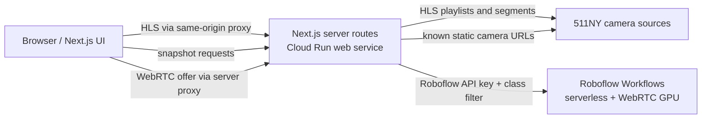

# XWALK KEYBOARDS Technical Architecture

## Purpose and scope

This document defines the production architecture for **XWALK KEYBOARDS**. It
is based on the working `511NY-test` and `crosswalk-agent` prototypes, but is
written as the implementation contract for the production app.

The app has one study:

| Study | Source | Vision path | Audio path | Timing model |
| --- | --- | --- | --- | --- |
| Realtime | One live 511NY HLS camera | Roboflow Workflow over WebRTC | Browser Web Audio API | Event-driven, current frame only |

Two earlier scored-snapshot studies (Orchestration and its successor design,
Sequence) were removed in 2026-08; see VIN-18/VIN-20.

The Camera Registry is an internal diagnostic view. It fetches one snapshot
per registered static camera and may display independent live previews, but
never runs Roboflow or the scoring agent.

The architecture is designed around three non-negotiable properties:

1. **No secrets in the browser.** 511NY, Roboflow, and agent credentials stay
   in server-side environment variables or Secret Manager.
2. **A visual frame and its sound must be attributable to the same source.**
   Realtime only uses current prediction data.
3. **Media work stops when its route is left.** Navigation disposes of HLS,
   WebRTC, polling, queued inference, audio schedules, and audio nodes that
   belong to the previous route.

## System overview

### High-level system diagram

```text
+------------------------------+
| Browser                      |
| Homepage, Realtime,          |
| and Camera Registry          |
|                              |
| Owns UI, audio scheduling,   |
| and cleanup.                 |
+--------------+---------------+
               |
               | same-origin HTTP
               | GET /api/hls/*, GET /api/snapshot/*
               | GET /api/calibration/*, POST /api/roboflow/*
               v
+--------------+------------------------------------+
| Next.js web app / Cloud Run: xwalk-keyboards      |
| media/source proxies | vendor-key boundary        |
| Roboflow proxies | input/schema validation        |
+---------+-----------------------+-----------------+
          |                       |
          | server-side GETs      | secret-auth
          |                       | workflow calls
          v                       v
+--------------------+  +----------------------+
| 511NY / NYSDOT     |  | Roboflow Workflows   |
| HLS View 5056      |  | Realtime predictions |
| static snapshots   |  | (person detections)  |
+--------------------+  +----------------------+

Interfaces
──────────
Browser → Next.js: HLS/snapshot GETs; WebRTC offer POSTs.
Next.js → Roboflow: secret-authenticated WebRTC setup.
Next.js → GCS: current calibration JSON for the requested camera.
Secret Manager → Next.js: API keys and service configuration only; never browser.
```



The browser owns presentation and audio scheduling. The Next.js service acts
as a boundary for third-party sources and secrets. Roboflow performs person
detection; the browser classifies detections against calibration geometry.

## Deployment units and responsibilities

### 1. Next.js web application

Deploy the XWALK KEYBOARDS web app to Cloud Run. It serves pages, client
components, and the same-origin API routes below. Keeping the routes in the
web service avoids CORS issues, protects vendor keys, and gives the browser a
stable API even when source-camera URLs change.

Build the app from the
[`web-scaffold-static-nextjs`](../../web-scaffold-static-nextjs/) repository.
That scaffold is the required Next.js foundation for the production web app;
retain its Cloud Run-ready container and deployment conventions, then add the
XWALK KEYBOARDS routes, media components, and server-side API handlers on top
of it.

The client is responsible for:

- page state, route transitions, and fullscreen behavior;
- rendering HLS video and static camera images;
- rendering the Realtime stripe overlay with a canvas above the local video;
- starting audio only after a user gesture;
- disposing all route-owned resources on unmount.

The web server is responsible for:

- validating all browser inputs and limiting payload sizes/timeouts;
- proxying HLS and static-image requests;
- detecting known 511NY maintenance/unavailable images;
- calling Roboflow with secret keys and validated runtime parameters;
- returning only the data the browser needs.

### 2. Roboflow Workflows

Use two production workflow profiles, even if they share a model:

- **Realtime workflow:** Roboflow WebRTC receives a captured stream from the
  local HLS `<video>`, detects `person`, applies the calibrated left and right
  West Street crosswalk polygons, and returns **prediction data only**. It
  must not return annotated video.
- **Snapshot workflow:** accepts a changed static JPEG plus that camera's
  calibrated crosswalk polygon(s), detects `person`, classifies detections as
  inside/outside, and returns the annotated image plus structured counts or
  detections. The annotated image contains green triangles for inside and
  purple triangles for outside pedestrians.

The precise output names must be configuration, not hardcoded component
assumptions. The required logical outputs are:

```text
all predictions
inside left crosswalk predictions     (Realtime)
inside right crosswalk predictions    (Realtime)
inside crosswalk predictions          (Snapshot, when one zone is used)
outside crosswalk predictions
annotated image                       (Snapshot)
```

## Canonical data and calibration

### Camera registry

Store camera metadata in version-controlled configuration. Do not call
511NY `GetCameras` during normal page loads. It is an offline curation tool,
not a runtime dependency.

Each camera record needs at least:

```ts
type CameraRecord = {
  cameraId: number;                 // stable 511NY view ID, for example 3259
  role: "priority" | "fallback" | "live";
  slot?: 1 | 2 | 3 | 4 | 5 | 6 | 7 | 8 | 9 | 10 | 11 | 12;
  viewUrl: string;                  // https://511ny.org/map/Cctv/<cameraId>
  snapshotUrl?: string;             // curated static source
  hlsUrl?: string;                  // curated live source
  displayLabel: string;             // Camera 06 · View 3259
  crosswalkCalibrationKey?: string;
};
```

The production registry contains exactly twelve priority snapshot cameras,
the configured fallback group, and the live Realtime source (View `5056`). A fallback is
assigned to the unavailable priority camera's **slot**, not inserted as a new
thirteenth tile. A given fallback may be assigned to at most one slot at a
time.

### Polygons and stripe calibration

Calibration must be keyed by camera ID, never grid position or display label.
The production source of truth should store both the reference frame size and
pixel coordinates:

```json
{
  "camera_5056": {
    "referenceFrame": { "width": 352, "height": 240 },
    "leftCrosswalk": [[0, 0]],
    "rightCrosswalk": [[0, 0]],
    "stripes": [{ "stripeIndex": 1, "segment": "left", "note": "C4", "polygon": [[0, 0]] }]
  }
}
```

The example is intentionally abbreviated. Real files contain three or more
points per polygon. A static camera may have one `horizontalCrosswalk` polygon
instead; configure its workflow parameter binding explicitly.

Coordinates must be scaled to the exact input frame passed to Roboflow:

```text
x_target = x_reference * targetWidth / referenceWidth
y_target = y_reference * targetHeight / referenceHeight
```

The calibration agent partitions each Realtime frame into **clusters** of white
stripes by gap, publishing them as `segment0`, `segment1`, ... in positional
order along the crosswalk axis, with stripes numbered ordinally `0..n-1` inside
each cluster. Cluster count is not fixed: a vehicle parked mid-crosswalk splits
one run into two, and a sparse read yields fewer.

The client numbers stripes **globally** across clusters in that order and plays
`baseAnchor + globalOrdinal` -- one continuous chromatic run from the camera's
single anchor (`C4` today), climbing left to right across the whole crossing.
On a complete read of View `5056` this reproduces the original hand-calibrated
keyboard exactly: 18 left stripes C4-F5, then 7 right stripes F#5-C6.

**Stripe identity is explicitly not stable across runs.** A stripe that goes
undetected renumbers every stripe after it, transposing the rest of the crossing
until the next calibration. This is a deliberate trade (VIN-44): an ascending
scale that starts somewhere different each day is still an ascending scale, and
the machinery that guaranteed otherwise cost more than the property was worth.
Freshness -- keys sitting on the paint -- is the guarantee that survives.

The agent does not publish crosswalk boundary polygons. The client synthesizes
one hit-region per cluster as a convex hull of that cluster's stripes, expanded
vertically, so a pedestrian stepping just off the paint still triggers the
nearest stripe. Because each cluster hulls separately, the median between two
crosswalk runs falls outside every hull and stays unplayable.

Validate calibration at build/test time:

- every configured polygon has finite points and a valid reference frame;
- every Realtime stripe carries a cluster and an ordinal within it.

## Realtime study architecture

### Video display and detection are separate paths

Realtime uses the original local HLS video as the viewport. Roboflow does not
send a replacement video stream back to the browser. This is essential: the
display remains at the best available HLS frame rate even when detection is
slower.

```mermaid
sequenceDiagram
  participant UI as Realtime browser UI
  participant HLS as Next.js HLS proxy
  participant NY as 511NY HLS CDN
  participant RFRoute as Next.js WebRTC route
  participant RF as Roboflow WebRTC workflow

  UI->>HLS: request playlist / segments
  HLS->>NY: fetch identity-encoded media
  NY-->>HLS: HLS content
  HLS-->>UI: local HLS video
  UI->>UI: video.captureStream()
  UI->>RFRoute: WebRTC offer + frame size
  RFRoute->>RF: offer, person class, scaled polygons
  RF-->>UI: prediction data for sampled frames
  UI->>UI: map current detections to stripes; draw overlay; play notes
```

The HLS proxy must fetch upstream media with `Accept-Encoding: identity` and
forward byte ranges for media segments. This avoids the observed NYSDOT
gzip/`206 Partial Content` decoding failure in Chrome. HLS playback should use
`hls.js` when Media Source Extensions are available, fall back to native HLS
where supported, and retry with bounded exponential backoff on fatal errors.

### Realtime lifecycle

The camera and GPU start independently. Model this as two state machines, not
one combined loading boolean:

```text
camera:    connecting -> live <-> reconnecting -> unavailable
inference: waiting -> starting -> active <-> reconnecting -> unavailable
```

- If the camera becomes live first, show video immediately while inference
  continues starting.
- If inference becomes active first, retain the waiting viewport until video
  is live.
- If the camera drops, retain inference state but clear stripe highlights and
  suppress notes until there is a current video frame.
- If inference drops, keep video playing, clear highlights, and suppress new
  notes without restarting HLS.
- On either recovery, use only new prediction data; never overlay stale
  detections onto later video.

The browser passes the captured stream's actual frame width and height to the
server WebRTC route. The route scales left/right polygons and initializes the
workflow with `person` as the class filter. Configure the WebRTC worker for
prediction data outputs and no annotated video output.

### Realtime visual and audio behavior

The overlay is a transparent `<canvas>` positioned over the `<video>`. It
maps the video’s intrinsic frame coordinates to the displayed `object-contain`
box on every resize. Only the occupied stripe polygons are filled with mint
at the specified visual opacity. Realtime has **no green or purple floating
triangles**.

The browser uses `AudioContext`, not Tone.js, for Realtime notes. After the
visitor enables sound:

1. Parse only inside-left and inside-right prediction outputs.
2. Use each detection's lower-body/foot point to find its calibrated stripe.
3. Trigger a short synthesized piano-like note only when a note becomes newly
   occupied; debounce repeat triggers for the same occupied note.
4. Do not trigger any outside-crosswalk detection.
5. When sound is disabled, suspend the audio context and clear occupancy
   state so re-enabling does not replay a stale event.

`SOUND ON` is a current-state label: qualifying new events must be audible.
An interval with no eligible pedestrian is intentionally silent. Fullscreen
retains video and overlay, hides surrounding UI, and exits on click or Escape.

## API boundary and configuration

Recommended Next.js API routes:

| Route | Consumer | Responsibility |
| --- | --- | --- |
| `GET /api/hls/:cameraId/:path*` | Realtime video | Validated HLS proxy; identity encoding and range support |
| `GET /api/snapshot/:cameraId` | Registry | Validated static-image proxy; source status and metadata headers |
| `POST /api/roboflow/webrtc` | Realtime | Validated WebRTC offer; server initializes workflow (class filter only; classification is client-side) |
| `GET /api/roboflow/turn` | Realtime | Optional TURN configuration proxy, if required by the Roboflow connector |

At minimum, configure these server-only environment values:

```text
ROBOFLOW_API_KEY
ROBOFLOW_WORKSPACE
ROBOFLOW_REALTIME_WORKFLOW_ID
ROBOFLOW_IMAGE_INPUT / ROBOFLOW_DATA_OUTPUT parameter-name bindings
```

Keep all keys in Secret Manager for Cloud Run deployments. Use small body-size
limits, explicit timeouts, no-store cache headers for live sources, allowlists
for camera IDs and path segments, and server-side request logging without
capturing secrets or full image payloads.

## Observability and operational behavior

Emit structured metrics/logs for:

- HLS connection state, stalls, retries, and recovery;
- snapshot polling latency, byte-change frequency, and unavailable signature;
- primary-to-fallback assignment and recovery;
- Roboflow inference queue depth, latency, retries, and error rate;
- audio enablement and scheduling drift.

Do not log API keys, raw WebRTC offers, full image bytes, or personally
identifying user data. Camera images should be treated as operational data;
retain only as long as needed for an active batch and debugging unless an
explicit durable-storage policy is approved.

The first production version does **not** require Google Cloud Storage or
Eventarc. Direct browser → Next.js → scoring-service requests minimize
latency and complexity. Add GCS/Eventarc only when durable replay, audit
history, asynchronous scoring, or multi-viewer synchronization is a real
requirement. If added, upload all assets under a `batchId` prefix and write
`manifest.json` last; process that manifest idempotently because Eventarc is
at-least-once.

## Route cleanup contract

Every study component must cancel its own work on unmount:

| Leaving route | Required cleanup |
| --- | --- |
| Realtime | Destroy `hls.js`, pause and unload video, stop captured media tracks, clean up WebRTC worker, clear canvas state, suspend/close `AudioContext`, clear note occupancy |
| Camera Registry | Abort snapshot/live-preview loads and release preview players |

Use `AbortController`, generation IDs, and `cancelled` guards so that a late
response cannot mutate a component after it has unmounted or replace a newer
candidate. Navigation begins only the destination route’s required work.

## Verification and test plan

Unit tests should cover:

- camera registry completeness and stable priority/fallback labeling;
- unavailable-image fingerprint classification;
- polygon and stripe scaling at reference and non-reference dimensions;
- seam midpoint/nearest-stripe assignment, median silence, and note mapping.

Integration tests should cover:

- HLS proxy identity encoding and range forwarding;
- Realtime independent camera/inference startup and recovery;
- cleanup when moving between Homepage, Realtime, and Registry.

## User-scenario alignment

This architecture aligns with [`users-scenarios.md`](users-scenarios.md):

| Scenario requirement | Architectural mechanism |
| --- | --- |
| Independent Realtime camera and GPU startup/recovery | Separate HLS and WebRTC state machines; neither restarts the other |
| Realtime striped-keyboard visual/audio with no triangles | Local video + canvas stripe overlay + Web Audio API, based only on inside predictions |
| Fullscreen, sound controls, Camera Registry, navigation cleanup | Route-scoped component resources, fullscreen presentation modes, Registry bypasses inference |
