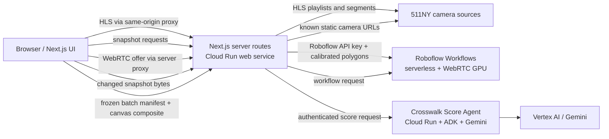
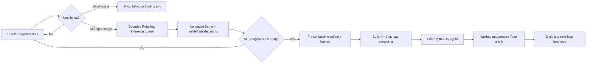

# XWALK KEYBOARDS Technical Architecture

## Purpose and scope

This document defines the production architecture for **XWALK KEYBOARDS**. It
is based on the working `511NY-test` and `crosswalk-agent` prototypes, but is
written as the implementation contract for the production app.

The app has two deliberately different studies:

| Study | Source | Vision path | Audio path | Timing model |
| --- | --- | --- | --- | --- |
| Realtime | One live 511NY HLS camera | Roboflow Workflow over WebRTC | Browser Web Audio API | Event-driven, current frame only |
| Orchestration | Twelve curated 511NY snapshots | Roboflow Workflow per changed snapshot, then Gemini/ADK batch scoring | Tone.js | Immutable 60-second batches; 5 seconds per camera |

The Camera Registry is an internal diagnostic view. It fetches one snapshot
per registered static camera and may display independent live previews, but
never runs Roboflow or the scoring agent.

The architecture is designed around three non-negotiable properties:

1. **No secrets in the browser.** 511NY, Roboflow, and agent credentials stay
   in server-side environment variables or Secret Manager.
2. **A visual frame and its sound must be attributable to the same source.**
   Realtime only uses current prediction data. Orchestration only plays a
   score with the exact frozen twelve-image batch that was scored.
3. **Media work stops when its route is left.** Navigation disposes of HLS,
   WebRTC, polling, queued inference, audio schedules, and audio nodes that
   belong to the previous route.

## System overview



The browser owns presentation and audio scheduling. The Next.js service acts
as a boundary for third-party sources and secrets. Roboflow performs object
detection and crosswalk classification. The scoring agent makes a constrained
visual and musical interpretation of a complete Orchestration batch; it never
returns JavaScript for the browser to evaluate.

## Deployment units and responsibilities

### 1. Next.js web application

Deploy the XWALK KEYBOARDS web app to Cloud Run. It serves pages, client
components, and the same-origin API routes below. Keeping the routes in the
web service avoids CORS issues, protects vendor keys, and gives the browser a
stable API even when source-camera URLs change.

Build the app from the
[`web-scaffold-static-nextjs`](../../web-scaffold-static-nextjs/) repository.
That scaffold is the required Next.js foundation for the production web app;
retain its Cloud Run-ready container and deployment conventions, then add the
XWALK KEYBOARDS routes, media components, and server-side API handlers on top
of it.

The client is responsible for:

- page state, route transitions, and fullscreen behavior;
- rendering HLS video and static camera images;
- creating the 4 × 3 Orchestration composite with an off-screen canvas;
- rendering the Realtime stripe overlay with a canvas above the local video;
- starting audio only after a user gesture;
- disposing all route-owned resources on unmount.

The web server is responsible for:

- validating all browser inputs and limiting payload sizes/timeouts;
- proxying HLS and static-image requests;
- detecting known 511NY maintenance/unavailable images;
- calling Roboflow with secret keys and calibrated runtime parameters;
- proxying authenticated score requests to the agent;
- returning only the data the browser needs.

### 2. Roboflow Workflows

Use two production workflow profiles, even if they share a model:

- **Realtime workflow:** Roboflow WebRTC receives a captured stream from the
  local HLS `<video>`, detects `person`, applies the calibrated left and right
  West Street crosswalk polygons, and returns **prediction data only**. It
  must not return annotated video.
- **Snapshot workflow:** accepts a changed static JPEG plus that camera's
  calibrated crosswalk polygon(s), detects `person`, classifies detections as
  inside/outside, and returns the annotated image plus structured counts or
  detections. The annotated image contains green triangles for inside and
  purple triangles for outside pedestrians.

The precise output names must be configuration, not hardcoded component
assumptions. The required logical outputs are:

```text
all predictions
inside left crosswalk predictions     (Realtime)
inside right crosswalk predictions    (Realtime)
inside crosswalk predictions          (Snapshot, when one zone is used)
outside crosswalk predictions
annotated image                       (Snapshot)
```

### 3. Crosswalk Score Agent

Deploy the Python `crosswalk-agent` service to its own Cloud Run service. It
uses Google ADK and Gemini through Vertex AI and exposes only:

```text
GET  /health                 public health check
POST /api/score-batch        application-key protected
```

`POST /api/score-batch` accepts multipart fields `manifest` and `composite`.
It validates the manifest and image, sends the composite plus a constrained
prompt to Gemini, normalizes the result, and returns declarative score data.

The service must use a least-privilege Cloud Run runtime service account for
Vertex AI and Secret Manager. The app-to-agent key belongs in Secret Manager
and is injected into both server processes; it is never a `NEXT_PUBLIC_`
value.

## Canonical data and calibration

### Camera registry

Store camera metadata in version-controlled configuration. Do not call
511NY `GetCameras` during normal page loads. It is an offline curation tool,
not a runtime dependency.

Each camera record needs at least:

```ts
type CameraRecord = {
  cameraId: number;                 // stable 511NY view ID, for example 3259
  role: "priority" | "fallback" | "live";
  slot?: 1 | 2 | 3 | 4 | 5 | 6 | 7 | 8 | 9 | 10 | 11 | 12;
  viewUrl: string;                  // https://511ny.org/map/Cctv/<cameraId>
  snapshotUrl?: string;             // curated static source
  hlsUrl?: string;                  // curated live source
  displayLabel: string;             // Camera 06 · View 3259
  crosswalkCalibrationKey?: string;
};
```

The production registry contains exactly twelve priority snapshot cameras,
the configured fallback group, and the live West Street source. A fallback is
assigned to the unavailable priority camera's **slot**, not inserted as a new
thirteenth tile. A given fallback may be assigned to at most one slot at a
time.

### Polygons and stripe calibration

Calibration must be keyed by camera ID, never grid position or display label.
The production source of truth should store both the reference frame size and
pixel coordinates:

```json
{
  "camera_5059": {
    "referenceFrame": { "width": 352, "height": 240 },
    "leftCrosswalk": [[0, 0]],
    "rightCrosswalk": [[0, 0]],
    "stripes": [{ "stripeIndex": 1, "segment": "left", "note": "C4", "polygon": [[0, 0]] }]
  }
}
```

The example is intentionally abbreviated. Real files contain three or more
points per polygon. A static camera may have one `horizontalCrosswalk` polygon
instead; configure its workflow parameter binding explicitly.

Coordinates must be scaled to the exact input frame passed to Roboflow:

```text
x_target = x_reference * targetWidth / referenceWidth
y_target = y_reference * targetHeight / referenceHeight
```

For West Street, preserve the left and right crosswalks as distinct polygons
with an unplayable median between them. Its stripe mapping is one continuous
keyboard: right-side stripes have higher notes, followed by the left-side
stripes at lower notes as a person walks right-to-left toward and beyond the
median. Within a crosswalk segment, seam ownership is defined by the midpoint
between neighboring white stripes, so a person near a seam is assigned to the
nearest stripe rather than lost to a gap.

Validate calibration at build/test time:

- every priority camera has its required crosswalk configuration;
- every configured polygon has finite points and a valid reference frame;
- every West Street stripe is ordered and has a unique note;
- a fallback camera has calibration before it can substitute into a scored
  slot, or is marked registry-only and excluded from Orchestration fallback.

## Realtime study architecture

### Video display and detection are separate paths

Realtime uses the original local HLS video as the viewport. Roboflow does not
send a replacement video stream back to the browser. This is essential: the
display remains at the best available HLS frame rate even when detection is
slower.

```mermaid
sequenceDiagram
  participant UI as Realtime browser UI
  participant HLS as Next.js HLS proxy
  participant NY as 511NY HLS CDN
  participant RFRoute as Next.js WebRTC route
  participant RF as Roboflow WebRTC workflow

  UI->>HLS: request playlist / segments
  HLS->>NY: fetch identity-encoded media
  NY-->>HLS: HLS content
  HLS-->>UI: local HLS video
  UI->>UI: video.captureStream()
  UI->>RFRoute: WebRTC offer + frame size
  RFRoute->>RF: offer, person class, scaled polygons
  RF-->>UI: prediction data for sampled frames
  UI->>UI: map current detections to stripes; draw overlay; play notes
```

The HLS proxy must fetch upstream media with `Accept-Encoding: identity` and
forward byte ranges for media segments. This avoids the observed NYSDOT
gzip/`206 Partial Content` decoding failure in Chrome. HLS playback should use
`hls.js` when Media Source Extensions are available, fall back to native HLS
where supported, and retry with bounded exponential backoff on fatal errors.

### Realtime lifecycle

The camera and GPU start independently. Model this as two state machines, not
one combined loading boolean:

```text
camera:    connecting -> live <-> reconnecting -> unavailable
inference: waiting -> starting -> active <-> reconnecting -> unavailable
```

- If the camera becomes live first, show video immediately while inference
  continues starting.
- If inference becomes active first, retain the waiting viewport until video
  is live.
- If the camera drops, retain inference state but clear stripe highlights and
  suppress notes until there is a current video frame.
- If inference drops, keep video playing, clear highlights, and suppress new
  notes without restarting HLS.
- On either recovery, use only new prediction data; never overlay stale
  detections onto later video.

The browser passes the captured stream's actual frame width and height to the
server WebRTC route. The route scales left/right polygons and initializes the
workflow with `person` as the class filter. Configure the WebRTC worker for
prediction data outputs and no annotated video output.

### Realtime visual and audio behavior

The overlay is a transparent `<canvas>` positioned over the `<video>`. It
maps the video’s intrinsic frame coordinates to the displayed `object-contain`
box on every resize. Only the occupied stripe polygons are filled with mint
at the specified visual opacity. Realtime has **no green or purple floating
triangles**.

The browser uses `AudioContext`, not Tone.js, for Realtime notes. After the
visitor enables sound:

1. Parse only inside-left and inside-right prediction outputs.
2. Use each detection's lower-body/foot point to find its calibrated stripe.
3. Trigger a short synthesized piano-like note only when a note becomes newly
   occupied; debounce repeat triggers for the same occupied note.
4. Do not trigger any outside-crosswalk detection.
5. When sound is disabled, suspend the audio context and clear occupancy
   state so re-enabling does not replay a stale event.

`SOUND ON` is a current-state label: qualifying new events must be audible.
An interval with no eligible pedestrian is intentionally silent. Fullscreen
retains video and overlay, hides surrounding UI, and exits on click or Escape.

## Orchestration study architecture

### Snapshot acquisition and source health

The browser asks a same-origin route for each curated snapshot. The route
fetches a known static camera URL with caching disabled, returns image bytes,
and includes:

```text
X-Camera-Status: active | unavailable
X-Source-ETag / X-Source-Last-Modified: upstream metadata when available
```

The route fingerprints returned bytes and compares their SHA-256 values with a
versioned set of known 511NY unavailable images (for example, “This camera is
being serviced” and “No live camera feed at this time”). This check is content
agnostic with respect to ordinary traffic images: only known outage signatures
or request errors mark a source unavailable.

The browser additionally fingerprints each successful image locally or uses a
server-provided digest. A source change is detected by changed bytes, not by a
poll timestamp. This matters because 511NY snapshots may update in staggered
phases rather than simultaneously.

Poll all active source slots continuously while the page is mounted. The
prototype uses a five-second poll cadence to discover snapshots that update on
roughly minute-long, offset schedules. Production must make cadence,
concurrency, timeouts, and per-origin request budgets configurable, and must
be verified against the final 511NY access terms before launch. Never use
`GetCameras` in this loop.

### Priority and fallback selection

For each priority slot:

1. Request the currently assigned source.
2. If the priority source is unavailable or fetch fails, reserve the first
   available configured fallback not used by another slot.
3. Poll that fallback in the priority slot while probing the original priority
   source periodically (the prototype probes once per minute).
4. If a fallback fails, attempt another unreserved fallback.
5. If the primary recovers, enqueue it and restore it only in a later frozen
   batch; never replace a frame inside the active batch.

If no fallback is available, retain and replay the previous valid batch rather
than presenting a missing tile or an unsynchronized batch. The Camera Registry
still displays unavailable sources in their registered locations.

### Queue, inference, and batch preparation

Each of the twelve logical grid slots owns:

- its currently displayed frame;
- a detected current source ID (priority or fallback);
- its latest byte fingerprint and source timestamp;
- at most one pending changed-frame inference candidate;
- one queued annotated frame for the next batch.

Initial snapshots populate the first full-color grid without calling Roboflow.
Only a **changed** snapshot becomes an inference candidate. Limit serverless
inference to a small fixed concurrency (the prototype uses two) and give each
candidate a bounded retry policy. A newer change supersedes an older pending
candidate for the same slot.



An annotation must include its logical slot camera ID *and* its actual source
camera ID, because a fallback can fulfill a priority slot. The logical slot
preserves visual order and interval timing. The actual source ID preserves
provenance and selects the correct calibration.

### Immutable 60-second batch contract

A batch is eligible only when it contains exactly one annotated frame for each
of the twelve stable positions. Freeze the frame references and create a
manifest before composing or scoring:

```json
{
  "schemaVersion": "1",
  "batchId": "batch-<timestamp>-<sequence>",
  "createdAt": "<ISO-8601>",
  "intervalSeconds": 5,
  "durationSeconds": 60,
  "cameras": [
    {
      "index": 0,
      "cameraId": 3256,
      "sourceCameraId": 3256,
      "gridPosition": "top-left",
      "intervalStartSeconds": 0,
      "sourceTimestamp": "<upstream timestamp>",
      "predictionCount": 3
    }
  ]
}
```

The position order is fixed: left-to-right, top-to-bottom; index `0` starts at
0 seconds and index `11` starts at 55 seconds. The composite, the score
events, and the visible active-camera sequence must all use this order.

Create the agent input in the browser with an off-screen `<canvas>`:

- 4 columns × 3 rows;
- deterministic cell dimensions and a black background;
- cell identifiers `01`–`12` outside the camera pixels;
- the same image crop used in the UI (remove the baked-in 511NY info header);
- no stretching and no labels over a crosswalk;
- JPEG/PNG small enough for the configured agent limit (the prototype is
  capped at 7 MB).

Use double buffering:

```text
Batch N:      visible and playing for 60 seconds
Batch N + 1:  polling -> inference -> frozen -> composite -> score -> prepared
```

Promote Batch N+1 only at the loop boundary, and only when the frozen frames,
composite, returned `batchId`, strict score validation, and Tone graph
preparation all succeed. Never insert a later image into Batch N.

If a new batch is late or invalid, replay Batch N and its matching score. If
agent scoring fails twice, the agent service can return a schema-valid
all-rest score for its submitted batch; the web app may promote that batch only
if product policy permits a silent valid score. It must never show a batch with
someone else’s score.

### Orchestration visual and audio behavior

Before the first complete scored batch is ready, display the initial full-color
grid and a non-blocking preparation indicator. Once ready, render the active
slot in full color and the other eleven tiles in grayscale.

The active tile uses the annotated snapshot:

- a green triangle marks a pedestrian inside the calibrated crosswalk;
- a purple triangle marks a pedestrian outside it;
- there is **no Realtime-style stripe glow** in Orchestration.

Tone.js owns the authoritative 60-second timeline. Schedule both the camera
state swap and the score event at `event.index * 5` on the same Tone Transport;
use `Tone.Draw` to synchronize React state with the audio clock instead of an
independent browser `setInterval`.

The fixed audio renderer builds only an allowlisted set of voices and effects
(FM/AM/poly/pluck, limited effects, pan, velocity, durations, and gestures).
The agent returns data, not code. The renderer owns the limiter, gains,
polyphony limits, deterministic scatter, disposal, and fade/release behavior.

`SOUND ON` means future qualifying score events are audible. `SOUND OFF` stops
new events and silences currently sounding/fading nodes while the visual loop
continues. When the active five-second slot advances, started notes are allowed
to release naturally rather than being abruptly cut off; only explicit sound
off and route cleanup stop them immediately.

Fullscreen preserves the 3 × 4 grid and active color/grayscale treatment,
hides the controls, and exits on click or Escape.

## Scoring service contract

The browser posts the frozen manifest and canvas composite to the Next.js
`/api/score-batch` route. That route validates them, adds the private agent
key, and forwards the multipart request to Cloud Run with an explicit timeout.
The browser never contacts Gemini or the scoring service directly.

The agent must return JSON data conforming to schema version 2. Important
fields are:

```ts
type Score = {
  schemaVersion: "2";
  batchId: string;
  intervalSeconds: 5;
  durationSeconds: 60;
  musicDirection: { title: string; description: string; masterReverb: number };
  voices: Array<{ id: string; instrument: string; preset: string; effects: unknown[] }>;
  events: Array<{
    index: 0 | 1 | 2 | 3 | 4 | 5 | 6 | 7 | 8 | 9 | 10 | 11;
    cameraId: number;
    gridPosition: string;
    intervalStartSeconds: number;
    occupancy: "none" | "occupied" | "uncertain";
    occupiedStripeIndexes: number[];
    gesture: "chord" | "ascending" | "descending" | "pulse" | "swell" | "scatter" | "rest";
    voiceId: string;
    durationSeconds: number;
    velocity: number;
    pan: number;
    octaveShift: -1 | 0 | 1;
    arpeggioSpacingSeconds: number;
  }>;
};
```

The agent analyzes only the designated horizontal crosswalk in each numbered
cell, treats Roboflow triangles as hints rather than proof, and returns stripe
indexes—not authoritative note spellings. It must return exactly twelve events
in manifest order.

Both the agent and Next.js validate the response. Normalization verifies the
`batchId`, exact event count/order, camera identity, event timing, allowed
voice/preset/effect values, numeric ranges, and occupancy consistency. The
application derives C harmonic minor pitches from stripe indexes:

```text
0 -> C4, 1 -> D4, 2 -> Eb4, 3 -> F4, 4 -> G4, 5 -> Ab4, 6 -> B4, 7 -> C5 ...
```

## API boundary and configuration

Recommended Next.js API routes:

| Route | Consumer | Responsibility |
| --- | --- | --- |
| `GET /api/hls/:cameraId/:path*` | Realtime video | Validated HLS proxy; identity encoding and range support |
| `GET /api/snapshot/:cameraId` | Registry, Orchestration | Validated static-image proxy; source status and metadata headers |
| `POST /api/roboflow/webrtc?frameWidth=&frameHeight=` | Realtime | Validated WebRTC offer; server initializes workflow with scaled polygons |
| `POST /api/roboflow/image` | Orchestration | Image validation; per-source calibration; snapshot workflow call |
| `POST /api/score-batch` | Orchestration | Manifest/composite validation; authenticated agent proxy; returned-score validation |
| `GET /api/roboflow/turn` | Realtime | Optional TURN configuration proxy, if required by the Roboflow connector |

At minimum, configure these server-only environment values:

```text
ROBOFLOW_API_KEY
ROBOFLOW_WORKSPACE
ROBOFLOW_REALTIME_WORKFLOW_ID
ROBOFLOW_SNAPSHOT_WORKFLOW_ID
ROBOFLOW_*_INPUT / OUTPUT parameter-name bindings
CROSSWALK_AGENT_URL
CROSSWALK_AGENT_API_KEY
```

The score agent requires:

```text
GOOGLE_CLOUD_PROJECT
GOOGLE_CLOUD_LOCATION=global
GOOGLE_GENAI_USE_VERTEXAI=true
CROSSWALK_AGENT_MODEL=gemini-2.5-flash
CROSSWALK_AGENT_API_KEY
CROSSWALK_RATE_LIMIT_PER_MINUTE
```

Keep all keys in Secret Manager for Cloud Run deployments. Use small body-size
limits, explicit timeouts, no-store cache headers for live sources, allowlists
for camera IDs and path segments, and server-side request logging without
capturing secrets or full image payloads.

## Observability and operational behavior

Emit structured metrics/logs for:

- HLS connection state, stalls, retries, and recovery;
- snapshot polling latency, byte-change frequency, and unavailable signature;
- primary-to-fallback assignment and recovery;
- Roboflow inference queue depth, latency, retries, and error rate;
- batch creation, scoring latency, validation failures, replay count, and
  active/ready batch IDs;
- audio enablement, transport start/stop, and scheduling drift;
- agent model, duration, response source (`agent` or `fallback`), and safe
  confidence summaries.

Do not log API keys, raw WebRTC offers, full image bytes, or personally
identifying user data. Camera images should be treated as operational data;
retain only as long as needed for an active batch and debugging unless an
explicit durable-storage policy is approved.

The first production version does **not** require Google Cloud Storage or
Eventarc. Direct browser → Next.js → scoring-service requests minimize
latency and complexity. Add GCS/Eventarc only when durable replay, audit
history, asynchronous scoring, or multi-viewer synchronization is a real
requirement. If added, upload all assets under a `batchId` prefix and write
`manifest.json` last; process that manifest idempotently because Eventarc is
at-least-once.

## Route cleanup contract

Every study component must cancel its own work on unmount:

| Leaving route | Required cleanup |
| --- | --- |
| Realtime | Destroy `hls.js`, pause and unload video, stop captured media tracks, clean up WebRTC worker, clear canvas state, suspend/close `AudioContext`, clear note occupancy |
| Orchestration | Abort or ignore outstanding polls/inference/score requests, clear timers, revoke object URLs, dispose Tone Transport and audio graph, release scheduled events, clear frame queues |
| Camera Registry | Abort snapshot/live-preview loads and release preview players |

Use `AbortController`, generation IDs, and `cancelled` guards so that a late
response cannot mutate a component after it has unmounted or replace a newer
candidate. Navigation begins only the destination route’s required work.

## Verification and test plan

Unit tests should cover:

- camera registry completeness and stable priority/fallback labeling;
- unavailable-image fingerprint classification;
- polygon and stripe scaling at reference and non-reference dimensions;
- seam midpoint/nearest-stripe assignment, median silence, and note mapping;
- manifest order, batch immutability, score schema validation, and rejected
  batch-ID mismatches;
- score normalization/allowlist enforcement and silent fallback;
- composite cell order, crop, labels, and dimensions.

Integration tests should cover:

- HLS proxy identity encoding and range forwarding;
- Realtime independent camera/inference startup and recovery;
- one changed snapshot per slot flowing through bounded inference to a frozen
  batch;
- unavailable primary substitution and later primary recovery;
- late/invalid score causing prior valid batch replay;
- `SOUND ON`/`SOUND OFF`, five-second event timing, and fullscreen exit;
- cleanup when moving between Homepage, Realtime, Orchestration, and Registry.

## User-scenario alignment

This architecture aligns with [`users-scenarios.md`](users-scenarios.md):

| Scenario requirement | Architectural mechanism |
| --- | --- |
| Independent Realtime camera and GPU startup/recovery | Separate HLS and WebRTC state machines; neither restarts the other |
| Realtime striped-keyboard visual/audio with no triangles | Local video + canvas stripe overlay + Web Audio API, based only on inside predictions |
| Orchestration 3 × 4, color active tile, grayscale ensemble, green/purple triangles | Snapshot workflow returns annotated frames; fixed transport updates one active slot every five seconds |
| Initial color grid plus non-blocking preparation | Initial snapshots render immediately; changed snapshots build background queues and batches |
| Continuous polling, fallbacks, and later recovery | Per-slot polling, image health fingerprints, reserved fallback assignment, periodic primary probes |
| Matched visual/audio 60-second loop and prior-batch replay | Frozen manifest, canvas composite, strict score `batchId`, double buffer, loop-boundary promotion |
| Realtime browser audio and Orchestration Tone.js | Separate audio engines and user-gesture enablement contracts |
| Fullscreen, sound controls, Camera Registry, navigation cleanup | Route-scoped component resources, fullscreen presentation modes, Registry bypasses inference |
