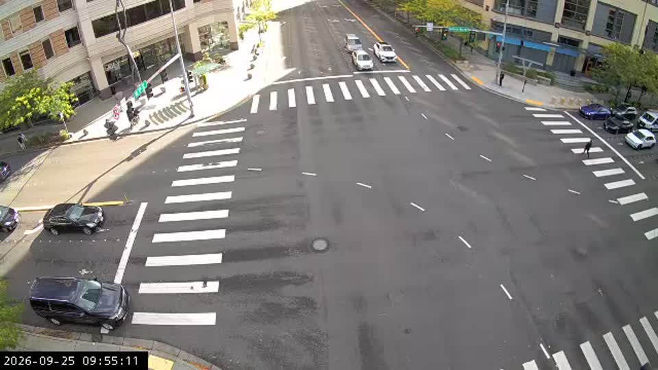

# Live-video replacements for XWALK KEYBOARDS

Researched and directly tested September 25, 2026. Recommendation: begin with Seattle SDOT; evaluate Bellevue alongside it. This research does not change the app or deploy a provider.

> **Decision (2026-09-25, VIN-79): Bellevue CCTV007, not Seattle.** Running Seattle Broadway/E Pike frames through Roboflow showed that its irregular markings (the roadwork noted below) would cause problems. We chose Bellevue Way NE & NE 8th St (`CCTV007`) instead, registered in the app as camera `80007`. Follow-up checks on that stream:
>
> - Playlist and segments return HTTP 200 with no key, H.264 at 640×360, about 10 s segments, and no gzip.
> - Paths follow the same Wowza `chunklist_w…` / `media_w…_N.ts` pattern the HLS proxy already accepts.
> - One session kept serving fresh segments for about 150 s, well past the 30-second limit. That limit is enforced only by the city player (`autoPauseInterval = 35` in its `config.js`), not by the server.
> - The inventory lists the camera as `360/PTZ`, so it may be pointed away from the crosswalk at times.
>
> Continuous third-party streaming still runs against the city's stated intent for that limit. Confirm with Bellevue Transportation before relying on it long-term.

## Scope and evidence

Ranked for visible painted crosswalks, pedestrian activity, working motion video, and integration friction. These are five publicly accessible API/feed options, **not five equally supported developer video APIs**. Some combine an official public camera inventory with undocumented endpoints used by the government's own player. Public access alone does not establish permission for indefinite redistribution or processing through Roboflow; that production-use question remains open.

For each provider below, a short H.264 HLS sample decoded successfully. Frames separated by two seconds were inspected for actual scene motion. These are short spot checks, not uptime or Roboflow accuracy tests. Dimensions and frame rates describe individual samples, not an entire provider. Frame-rate metadata does not establish unique motion frames per second. Reference JPEGs are extracted evidence from video, not proposed still-image inputs.

## 1. Seattle SDOT — best first integration

- **Verified crosswalk candidate:** Broadway & E Pike St, north/south view, stream `Broadway_E_Pike_NS`, inventory ID `CMR-0091`. Clear painted crossing in the foreground; pedestrians and moving vehicles visible. The sampled view also contains temporary roadwork, so recalibration and scene monitoring matter.
- **Transport:** working H.264 HLS, 720×480 in this sample. Other sampled Seattle feeds included 720×480/30 fps and 1920×1080/30 fps.
- **Access:** no key was required for the public inventory, player configuration, or sampled streams.
- **API distinction:** official ArcGIS REST inventory; HLS URL construction comes from the official site's player configuration rather than a separately documented video API.
- **Observed inventory:** 662 records, including 385 SDOT records with a stream name. These counts include inventory records, not a verified working-camera count.
- **Avoid selecting by street name alone:** the tested 2nd/Pike north/south camera aimed down the street, and 4th/Pine and 5th/Pine showed decorative paving rather than conventional zebra stripes. They had moving video but were weaker matches for the instrument.

[Official inventory/API](https://services.arcgis.com/ZOyb2t4B0UYuYNYH/arcgis/rest/services/Traffic_Cameras_CDL/FeatureServer/0) · [Official viewing map](https://web.seattle.gov/Travelers/) · [Official live-video description](https://www.seattle.gov/transportation/projects-and-programs/programs/technology-program)

Inventory request:

```text
https://services.arcgis.com/ZOyb2t4B0UYuYNYH/arcgis/rest/services/Traffic_Cameras_CDL/FeatureServer/0/query?where=OWNERSHIP%3D%27SDOT%27&outFields=UNITID,LOCATION,STREAM_NAME,SERVSTAT&outSR=4326&f=json
```

The official player's configuration endpoint returned the template below:

```text
GET https://web.seattle.gov/Travelers/api/Map/WowsaUrl
https://61e0c5d388c2e.streamlock.net:443/live/{stream}/playlist.m3u8
```

Substitute `{stream}` with `STREAM_NAME + ".stream"`. Tested candidate:

```text
https://61e0c5d388c2e.streamlock.net:443/live/Broadway_E_Pike_NS.stream/playlist.m3u8
```


## 2. City of Bellevue, Washington — best sampled stripe geometry

- **Verified candidate:** Bellevue Way NE & NE 8th St, `CCTV007`.
- **Visual fit:** large, high-contrast zebra crossings across the foreground and adjoining approaches. A pedestrian moves through the right-hand crossing in the sample. This was the clearest match to XWALK's stripe-based interaction.
- **Transport:** working H.264 HLS, 640×360, reported 20 fps.
- **Access:** public ArcGIS inventory and HLS, no key required in the spot check. Inventory contained 163 Bellevue-owned records with `Media=Stream`, among 234 total records.
- **Important limitation:** the official map FAQ says video stops after 30 seconds to manage network consumption. The public player configuration implements an auto-pause. A successful short direct HLS test does not establish that continuous third-party streaming is permitted or supported. Confirm sustained app use with the city before choosing it for production.
- **API distinction:** official public ArcGIS service plus stream construction published in the website's JavaScript; no separate supported video-developer contract found.

[City camera information](https://bellevuewa.gov/city-government/departments/transportation/traffic-conditions) · [Official map and FAQ](https://trafficmap.bellevuewa.gov/) · [Public player configuration](https://trafficmap.bellevuewa.gov/javascript/config.js)

Inventory request:

```text
https://services1.arcgis.com/EYzEZbDhXZjURPbP/ArcGIS/rest/services/TrafficCameras_Public_View/FeatureServer/0/query?where=OwnedBy%3D%27Bellevue%27%20AND%20Media%3D%27Stream%27&outFields=*&f=json
```

The official player combines its prefix, camera `ID`, and `L.stream/playlist.m3u8`. Tested candidate:

```text
https://trafficcams.bellevuewa.gov:443/traffic-edge/CCTV007L.stream/playlist.m3u8
```



## 3. Georgia 511 / GDOT — strong Midtown Atlanta views; token handling required

- **Verified candidate:** Peachtree St & 16th St, `ATL-CCTV-1004`; website camera-site ID `16083`, image/view ID `23493`.
- **Visual fit:** two clearly painted crossings, with a pedestrian visibly progressing across the near crossing in the sample.
- **Transport:** working H.264 HLS, 480×270, reported 15 fps.
- **Developer access:** documented camera metadata API requires registration and a developer key; documented limit is 10 calls per 60 seconds.
- **Important API gap:** the published camera/view schema does not promise a `VideoUrl` field. The successful video test used the public website's camera-list response and video resolver. Do not assume the documented metadata API alone provides everything needed for streaming.
- **Token behavior observed:** the public resolver returned an HLS URL carrying a JWT whose expiry was 120 seconds after issue time. The player supports URL refresh. A production adapter needs an approved, reliable token-renewal route; hardcoding the signed URL will fail.
- **Failure observed:** the sampled West Peachtree/10th stream did not decode successfully. Use Peachtree/16th as the verified starting candidate.

[Developer documentation](https://511ga.org/developers/doc) · [Camera API schema](https://511ga.org/help/endpoint/cameras) · [View schema](https://511ga.org/help/subendpoint/cameras) · [Official camera list](https://511ga.org/list/cameras)

Documented metadata endpoint:

```text
GET https://511ga.org/api/v2/get/cameras?key=YOUR_KEY&format=json
```

Observed website endpoint, not a documented developer API:

```text
GET https://511ga.org/Camera/GetVideoUrl?imageId=23493
```

It returns a JSON string with a short-lived signed URL on this stream path:

```text
https://sfs-msc-pub-lq-01.navigator.dot.ga.gov:443/rtplive/ATL-CCTV-1004/playlist.m3u8
```

The unsigned path above is an identifier, not a guaranteed playable URL. No live tokens are saved in this report.


## 4. Arlington County, Virginia — urban intersection coverage; limited viewing sessions

- **Verified candidates:** Fort Myer Dr & Fairfax Dr (`cam12`, Rosslyn) and Wilson Blvd & Washington Blvd (`cam11`, Clarendon area).
- **Visual fit:** `cam12` has a broad foreground zebra crossing; `cam11` shows multiple crossings but the tested picture was hazy. Both had moving video.
- **Transport:** working H.264 HLS, 352×240. The low source resolution is a practical constraint for small pedestrian detections even when the crossing geometry is good.
- **Access:** official website consumes a publicly accessible JSON catalog; no key needed for the tested catalog or HLS. Observed 315 catalog records, 309 marked online; online flags are not stream-health verification.
- **Important limitation:** official FAQ limits the website to one camera at a time and one minute per viewing session for bandwidth reasons. Confirm sustained third-party use before production.
- **API distinction:** public JSON feed plus player-derived HLS URLs; no separately documented supported developer video API found.

[Official map, usage limits, and FAQ](https://www.arlingtonva.us/Government/Programs/Transportation/Live-Traffic-Cameras)

Catalog used by the official page:

```text
https://datahub-v2-s3.arlingtonva.us/Uploads/AutomatedJobs/Traffic+Cameras.json?v=1604085425
```

Fields observed include `Camera Site`, `Camera EncoderB2`, `Latitude`, `Longitude`, `port`, and `STATUS`. The page constructs the HLS port as `int(port) + 10`. Both tested records use port `8001`, giving HLS port `8011`:

```text
https://itsvideo.arlingtonva.us:8011/live/cam12.stream/playlist.m3u8
https://itsvideo.arlingtonva.us:8011/live/cam11.stream/playlist.m3u8
```


## 5. Nevada 511 / NDOT — documented video API; reserve choice for this app

- **Coverage to investigate:** Las Vegas urban surface streets and downtown approaches. Distinguish at-grade crossings from pedestrian bridges and highway views.
- **Video verified:** Las Vegas Blvd & Charleston, website camera `7696`, decoded at 360×240 and reported 30 fps. Sahara/Las Vegas Blvd and the documentation's Ann/Commerce stream also decoded.
- **Why ranked last:** the Charleston view showed construction and weak crossing markings; the Sahara camera aimed along traffic rather than at a useful foreground crossing. Ann/Commerce was also a weak stripe view. I did not confirm a camera as visually suitable as the top four providers.
- **Failures:** Charleston/Fremont, Flamingo/Maryland, and Tropicana/Maryland returned 404 for their catalog-listed HLS URLs during these checks. Treat camera status flags as insufficient; probe playback.
- **Developer access:** documented camera API explicitly includes `Views[].VideoUrl` containing HLS URLs. Registration and developer key required for that API; documented limit is 10 calls per 60 seconds. The video checks used published documentation and the public map's catalog, not a registered API account.

[Camera API with HLS examples](https://www.nvroads.com/help/endpoint/cameras) · [Registration and rate limits](https://www.nvroads.com/developers/doc) · [Official camera list](https://www.nvroads.com/list/cameras)

```text
GET https://www.nvroads.com/api/v2/get/cameras?key=YOUR_KEY&format=json
```

Tested Charleston stream; its current composition is not recommended as the first instrument camera:

```text
https://d1wse1.its.nv.gov:443/vegasxcd01/527822bf-c919-4a46-b6df-ca12ca3ee389_lvflirxcd01_public.stream/playlist.m3u8
```

## Other options investigated

- **Iowa DOT:** a strong, officially supported credential-free ArcGIS feed containing `VideoURL`. Live samples from Waterloo decoded at 1080p/30 fps, and Sioux City/Dubuque samples at 480×270/15 fps. The inspected urban views had weak or absent zebra stripes and less promising pedestrian framing, so I ranked it below the five above for this specific instrument. [Official feed documentation](https://iowadot.gov/travel-tools/iowa-511/511-data-feeds).
- **Louisiana 511:** documented HLS video API, but the inspected catalog was heavily oriented toward highways and ramps, with no comparably strong downtown crossing candidate established. [API documentation](https://www.511la.org/help/endpoint/cameras).
- **TrafficLand:** commercial alternative with a documented `/stream/{publicId}` endpoint returning HLS/RTSP URLs. Streaming requires separate access from TrafficLand; it is not an anonymous, immediately available replacement. No licensed stream tested. [API docs](https://api.trafficland.com/docs).
- **Austin:** public image service provides JPEGs; the city's video service is restricted to whitelisted city-network users. Excluded for this requirement. [City's video-service documentation](https://github.com/cityofaustin/atd-cctv-service).

## Fit with the existing app

All five sampled providers supply H.264 over HLS, compatible in principle with the app's existing browser playback → captured frames → Roboflow WebRTC design. This does not prove integration success: none were connected to the app or sent to Roboflow during this research.

The first implementation trial should use Seattle Broadway/E Pike. Add the provider through the existing registered-camera/proxy boundary, recalibrate geometry for the new view, and verify actual person-to-stripe detection. Compare Bellevue CCTV007 after clarifying continuous access. Use frames from the same video view for calibration; a separately directed still camera can yield incorrect polygons. Run a sustained playback and restart test before the September 30, 1:00 pm ET cutover. Pan/tilt changes, short-lived URLs, image quality, and provider usage terms remain material acceptance criteria.
